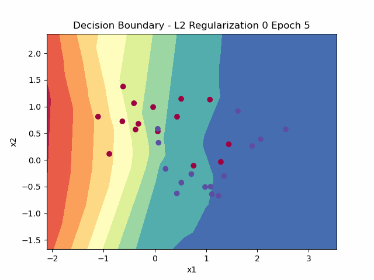
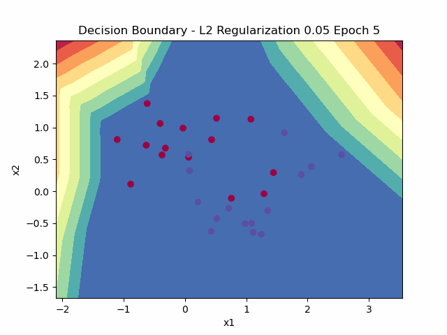

# Neural Network Framework

Decided to create my own to fully understand what's going on in the background as it is easy to rely on 3rd parties (keras, pytorch, tf or even matlab).
Definitely I've gained a lot of proficiency on dealing with large matrices. There were also some discoveries in SGD and GD in general.

## Dense Neural Networks

Implemented the following activations:
- Sigmoid
- tanh
- relu
- softmax (the derivative is a Jacobian)

Also added mini-batch and L2-regularization

Overfitting:

L2 Regularization:
This is pretty much a least squares with Tikhonov regularization (aka Ridge). 

## Resources
There is a lot of stuff out there, mostly low quality. It is difficult to find good material. Loads of crappy explanations in Medium and other blogs. Stick to academia.
https://www.deeplearningbook.org/
http://cs229.stanford.edu/notes/cs229-notes-deep_learning.pdf